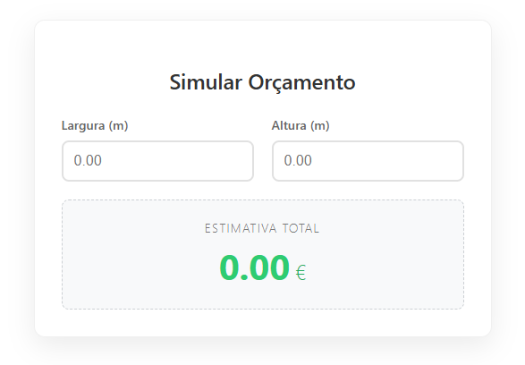

# WP Dynamic Pricing Calculator 🧮

A lightweight, modern WordPress plugin designed to help service-based businesses (glass shops, flooring, carpentry) provide instant cost estimates to their customers based on dimensions (m²).



## 🚀 Features

* **Real-time Calculation:** Uses Vanilla JavaScript to update prices instantly as the user types, with zero page reloads.
* **Admin Settings API:** Shop owners can easily adjust the "Price per Square Meter" in the WordPress Dashboard without touching a single line of code.
* **Responsive Design:** Fully styled with modern CSS (Card UI), looking great on mobile and desktop.
* **Shortcode System:** Can be deployed on any page using `[calculadora_orcamento]`.

## 🛠️ Tech Stack

* **Backend:** PHP (WordPress Plugin API, Settings API).
* **Frontend:** HTML5, CSS3 (Flexbox), JavaScript (ES6).

## 📂 Project Structure

```text
/wp-dynamic-pricing-calculator
├── wp-orcamento-simples.php  # Main Plugin File
├── README.md                 # Documentation
└── assets/                   # Screenshots